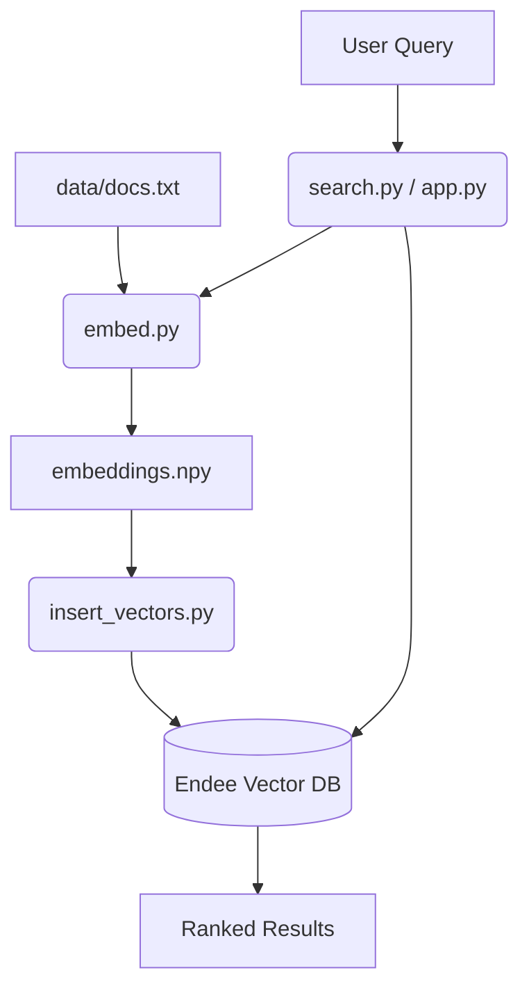

# AI Semantic Search Engine (Endee Powered)

## Overview
This project is a high-performance **AI-powered Semantic Search System**. By combining transformer-based embeddings with the **Endee Vector Database**, the system moves beyond traditional keyword matching to understand the actual intent and context of user queries.

---

## Key Features
- **Semantic Understanding:** Uses Transformer models to find results based on meaning (e.g., searching for "automobile" finds "car").
- **Vector Database:** High-speed retrieval using the **Endee** vector engine.
- **Dual Interfaces:** Choose between a developer-friendly **CLI** and a modern **Web UI**.
- **Dockerized:** Fully containerized backend for easy deployment and scalability.

---

## Technical Architecture

### 1. Vector Embeddings
The system utilizes the `sentence-transformers/all-MiniLM-L6-v2` model to convert raw text into **384-dimensional dense vectors**. This model provides an optimal balance between performance and inference speed.

### 2. Endee Integration
Endee serves as the core infrastructure for storing and retrieving high-dimensional vectors, utilizing:
- **Index Management:** Automated creation and configuration of vector indexes.
- **Similarity Search:** Executing ANN (Approximate Nearest Neighbor) searches.
- **Metadata Handling:** Seamless storage of original text alongside vector representations.

### 3. System Flow


---

## Getting Started

### 1. Prerequisites
- Python 3.8+
- Docker & Docker Compose

### 2. Setup Environment
```bash
pip install -r requirements.txt
docker compose up -d
```

### 3. Build the Index
```bash
python embed.py          # Step 1: Generate Vectors
python insert_vectors.py # Step 2: Ingest into Endee
```

### 4. Run the Search
**Option A: Modern Web UI (Recommended)**
```bash
streamlit run app.py
```

**Option B: Terminal CLI**
```bash
python search.py
```

---

## Project Structure
- `app.py`: Streamlit web interface.
- `docker-compose.yml`: Endee server configuration.
- `embed.py`: Embedding generation script.
- `insert_vectors.py`: Data ingestion logic.
- `search.py`: Interactive CLI tool.
- `data/docs.txt`: Knowledge base source.

---

## Author
**Suprit Lenkennavar**
AI and Data Science Student
