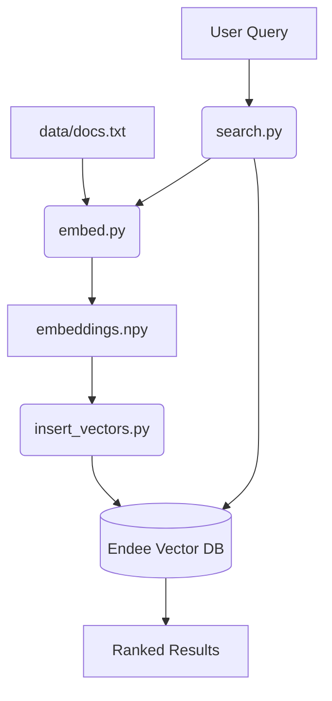

# AI Semantic Search with Endee Vector Database

## Overview
This project implements a high-performance AI-powered Semantic Search System. By combining transformer-based embeddings with the Endee Vector Database, the system moves beyond traditional keyword matching to understand the actual intent and context of user queries. This implementation satisfies the requirements for the Job ready Software intern assessment by demonstrating a practical, end-to-end AI workflow.

---

## Problem Statement
Traditional search systems rely on exact keyword matching, which often fails in the following scenarios:
- Synonym handling: A query for "intelligence machines" might not find a document containing "AI" or "neural networks".
- Contextual understanding: Keyword search cannot differentiate between different meanings of the same word based on surrounding text.
- Semantic similarity: Users often express ideas differently than how they are written in documentation.

This project addresses these issues by mapping text into a high-dimensional vector space where semantically similar concepts are geographically close, enabling the system to retrieve results based on meaning rather than string matching.

---

## Technical Approach

### 1. Vector Embeddings
The system utilizes the `sentence-transformers/all-MiniLM-L6-v2` model to convert raw text into 384-dimensional dense vectors. This model is chosen for its excellent balance between performance and inference speed, making it ideal for real-time semantic search applications.

### 2. Endee Vector Database Integration
Endee serves as the core infrastructure for storing and retrieving high-dimensional vectors. This project uses the official Endee Python SDK for:
- Index Management: Programmatic creation and configuration of vector indexes.
- Similarity Search: Executing approximate nearest neighbor (ANN) searches using the HNSW algorithm.
- Metadata Handling: Storing original text alongside vectors to enable rich search results.

### 3. System Architecture


---

## Project Structure
- docker-compose.yml: Configuration to spin up the Endee service using Docker.
- embed.py: Script to generate vector embeddings from source text files.
- insert_vectors.py: Script to ingest pre-computed vectors into the Endee database using the official SDK.
- search.py: Interactive CLI tool for performing semantic searches.
- data/docs.txt: Source documents used to build the knowledge base.
- requirements.txt: List of project dependencies.

---

## Getting Started

### 1. Prerequisites
- Python 3.8 or higher
- Docker and Docker Compose

### 2. Install Dependencies
Run the following command to install the required Python libraries:
```bash
pip install -r requirements.txt
```

### 3. Start the Vector Database
Use Docker Compose to start a local instance of the Endee server:
```bash
docker compose up -d
```
The database will be accessible at http://localhost:8080.

---

## Execution Workflow

### Step 1: Generate Embeddings
Convert the text documents in the data directory into vector representations:
```bash
python embed.py
```

### Step 2: Ingest Data into Endee
Create the index and upload the generated vectors to the local Endee instance:
```bash
python insert_vectors.py
```

### Step 3: Execute Semantic Search
Run the interactive search script to query the knowledge base:
```bash
python search.py
```

---

## Evaluation Criteria Compliance
- Practical Use Case: Implements a production-ready Semantic Search system.
- Integration: Fully utilizes the official Endee SDK and Docker infrastructure.
- Technical Documentation: Comprehensive explanation of system design and implementation.
- Version Control: Organized repository structure ready for GitHub submission.

---

## Author
Suprit Lenkennavar
AI and Data Science Student
